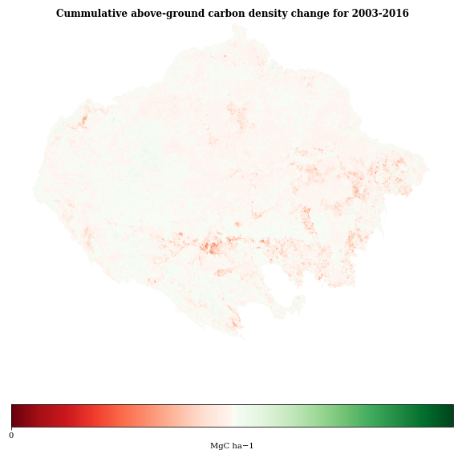

# Amazon-Indigenous-Carbon

This is an exploratory data analysis notebook for the dataset contained in this repo, arising from the paper “The role of forest conversion, degradation, and disturbance in the carbon dynamics of Amazon indigenous territories and protected areas.” [Walker 2020] It seeks to explore the visualization possibilities of the geotiff dataset.

Figure 1. A rough recreation of figure 1c in [Walker 2020]. It contains a few perceptual flaws that make it hard to decipher, and also innacesible to people with sight disabilities.

Figure 2. Re-rendering the plot with a logarithmic scale allows for better visibility of the differences between the high and low end of the ranges. It is advisiable to show both figures, the linear scale to get a sense of the absolute magnitudes, and the logarithmic scale to get a sense of the relative differences between large and small values. We also change the colormap to a color-blind accesible palette. Blues and yellows are preferable to red/green [Nuñez 2018], since the red and green color receptors are the ones most commonly affected by color blindness. Teal and gold give the plot a more appealing tonal balance, while still composed mostly of blue and yellow. Finally, the plot is animated  to show successive cumulative changes in above ground carbon density for each year from 2003-2016.

## References

[Nuñez 2018] Nuñez, Jamie R., Christopher R. Anderton and Ryan S. Renslow. “Optimizing colormaps with consideration for color vision deficiency to enable accurate interpretation of scientific data.” PLoS ONE 13 (2018).

[Walker 2020] Walker, Wayne S., Seth R. Gorelik, Alessandro Baccini, Jose Luis Aragon-Osejo, Carmen Josse, Chris Meyer, Marcia Nunes Macedo, Cicero Augusto, Sandra L. Rios, Tuntiak Katan, Alana Almeida de Souza, Saúl Cuéllar, Andres Llanos, Irene Zager, Gregorio Díaz Mirabal, Kylen K Solvik, Mary Farina, Paulo Moutinho and Stephan Schwartzman. “The role of forest conversion, degradation, and disturbance in the carbon dynamics of Amazon indigenous territories and protected areas.” Proceedings of the National Academy of Sciences of the United States of America 117 (2020): 3015 - 3025.

## A note on the license
This exploratory notebook, for the purposes of research, constitutes a fair use. However, please respect the original license at the bottom! Thanks to Walker et al and the Woodwell Climate Research Center.

#  Original Readme Begins Here

**Walker et al. 2020. The Role of Forest Conversion, Degradation, and Disturbance in the Carbon Dynamics of Amazon Indigenous Territories and Protected Areas. _Proceedings of the National Academy of Sciences_.**

This repository contains data central to the analysis reported by Walker et al. (2020) on the role of forest conversion, degradation, and disturbance in the carbon dynamics of Amazon indigenous territories and protected natural areas. These data include:

1. Two raster layers of aboveground live dry woody carbon spanning the biogeographic limit of the Amazon:
+ `Amazon_ACD_2003_500m_Mgha.tif` is a single-band GeoTIFF in which grid cells reflect aboveground carbon density for baseline year 2003.
+ `Amazon_ACD_Change_2003_2016_500m_Mgha.tif` is a 13-band GeoTIFF in which grid cells reflect annual aboveground carbon density change for the 2003-2016 time period (i.e., band 1 = 2003-2004; band 13 = 2015-2016). Only pixels exhibiting statistical significance at the 95% level are reported.

The spatial resolution is ca. 500 meters and the coordinate reference system is the MODIS sinusoidal projection ([SR-ORG:6842](https://spatialreference.org/ref/sr-org/modis-sinusoidal/)). Grid cell values are stored as 16-bit signed integers with units of megagrams of aboveground carbon per hectare (Mg/ha). Areas outside the biogeographical limit of the Amazon are assigned to NoData (-32768).

2. One vector layer containing the spatial distribution (ca. 2016) of Indigenous Territories (ITs), Protected Natural Areas (PNAs), IT/PNA Overlap, and Other Land categories within the biogeographic limit of the Amazon:
+ `msk_paises.gdb.tar.gz` is a compressed ESRI geodatabase containing a polygon feature class in which the "TIPO_UND" field indicates the land category (i.e., 1 = IT; 2 = PNA; 3 = IT/PNA Overlap; 4 = Other Land) and the "Pais" field indicates the three-letter ISO country code (e.g., "BOL" = Bolivia) of each polygon.

This work is licensed under a  [Creative Commons Attribution-NonCommercial-NoDerivatives 4.0 International License](http://creativecommons.org/licenses/by-nc-nd/4.0/). You may not use these data for commercial purposes; if you transform or build upon these data, you may not distribute the modified data. You must cite this paper (i.e., Walker et al. 2020) when using any of these datasets for any purpose.

